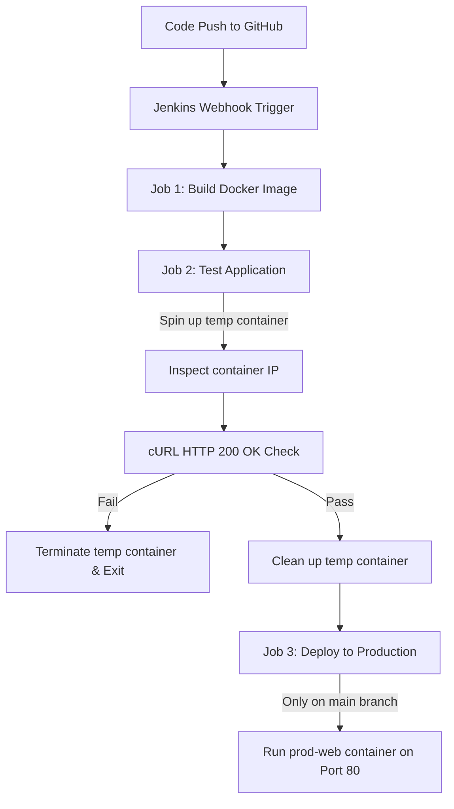

# DevOps CI/CD Web Application Capstone Project

This repository contains the configuration files and source code for a complete automated CI/CD pipeline. The pipeline leverages **Jenkins** and **Docker** to build, test, and deploy a static/dynamic web application to a production server environment.

---

## Architecture Flow

The pipeline automatically triggers upon code commits to build and validate the application container. Below is the workflow diagram:



---

## Project Structure

```
capstone-project/
├── Dockerfile          # Configuration for building the web server image
├── Jenkinsfile         # Jenkins declarative pipeline script defining build, test, and deploy stages
└── website-master/     # Web application source assets
    ├── index.html      # Main entry point website page
    └── images/         # Media/graphic assets
```

---

## Setup & Configuration Details

### 1. The Web Server (`Dockerfile`)
The application is built on top of the custom base image `hshar/webapp:latest` (which has Apache/PHP pre-installed).
- It copies the `website-master/` code directory into the server's HTML directory `/var/www/html/`.
- Exposes port `80`.

### 2. CI/CD Pipeline Stages (`Jenkinsfile`)
The pipeline runs dynamically and is segmented into three jobs:

*   **Stage 1: Build (`Job1 : build`)**
    Executes a standard Docker build using the Dockerfile in the project root:
    ```bash
    docker build -t hshar/webapp:build-${BUILD_NUMBER} .
    ```
*   **Stage 2: Test (`Job2 : test`)**
    Spins up a temporary test container in isolation, inspects its private IP, and runs a curl sanity check:
    ```bash
    # Runs temporary container
    docker run -d --name temp-test hshar/webapp:build-${BUILD_NUMBER}
    # Obtains private IP address
    TEST_IP=$(docker inspect -f '{{range .NetworkSettings.Networks}}{{.IPAddress}}{{end}}' temp-test)
    # Validates HTTP 200 OK response header
    curl -sI http://${TEST_IP} | grep "200 OK"
    ```
    If the response check fails, it terminates the temporary container and exits the build with a failure code.
*   **Stage 3: Production (`Job3 : prod`)**
    Triggers only when modifications are pushed directly to the `main` branch. It removes any existing production container (`prod-web`) and launches the newly built image, exposing it to host port `80`:
    ```bash
    docker rm -f prod-web || true
    docker run -d --name prod-web -p 80:80 hshar/webapp:build-${BUILD_NUMBER}
    ```

---

## Prerequisites for Deployment

To run this pipeline successfully, the Jenkins runner must have:
1. **Docker Engine** installed and running.
2. The `jenkins` user added to the `docker` group to execute Docker commands without `sudo` access:
   ```bash
   sudo usermod -aG docker jenkins
   sudo systemctl restart jenkins
   ```
3. Docker image registry access configuration (if running remote image distributions).
