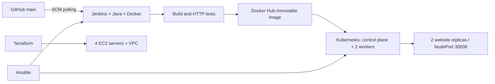

# DevOps Capstone: Jenkins, Docker and Kubernetes on AWS

A static website delivered through a Jenkins pipeline to a three-node Kubernetes cluster. Terraform creates four Ubuntu servers; Ansible installs and configures their software.

## Architecture


```mermaid
flowchart LR
  Git[GitHub main] -->|SCM polling| Jenkins[Jenkins + Java + Docker]
  Jenkins --> Test[Build and HTTP tests]
  Test --> Hub[Docker Hub immutable image]
  Hub --> K8s[Kubernetes: control plane + 2 workers]
  K8s --> Web[2 website replicas / NodePort 30008]
  TF[Terraform] --> AWS[4 EC2 servers + VPC]
  Ansible[Ansible] --> Jenkins
  Ansible --> K8s
```

## Requirements and implementation

| Requirement | Implementation |
|---|---|
| Version control | Feature branches -> develop -> reviewed main; main is this repository's equivalent of the brief's master branch |
| Build on changes | Jenkins polls main every two minutes; GitHub Actions also builds/tests every branch push and pull request |
| Custom Docker image | Dockerfile packages website-master in nginx; tests verify HTML and image asset |
| Registry | mohdvaqui002/capstone-project; Jenkins stores Docker credentials, never source code |
| Kubernetes | 2 replicas, health probes, resource limits, placement across workers, NodePort 30008 |
| Pipeline | Build -> test -> push the same image -> deploy by SHA256 digest |
| Release schedule | Production deployment only on the 25th, Asia/Kolkata; scheduled build plus independent script guard |
| Configuration | Ansible installs Jenkins/Java/Docker and kubeadm/containerd/Flannel |
| Infrastructure | Terraform creates VPC/subnet/routes/security groups and four EC2 servers |

The brief says CodeBuild and also specifies Jenkins. This implementation uses Jenkins for the code-build stage; it does not provision AWS CodeBuild. Confirm that interpretation with your assessor if a distinct AWS service is required.

## Files

- terraform/: reusable AWS source, provider lock file and example values.
- ansible/: controller bootstrap, inventory example, playbook and installation scripts.
- k8s/: application and namespace-scoped Jenkins RBAC.
- scripts/: release-date guard and deployment with rollback on rollout failure.
- Jenkinsfile: pipeline from main; one executor and no concurrent builds.
- .github/workflows/container-ci.yml: build/test checks across branches.

## Infrastructure and configuration

Existing live state is maintained separately in the original Terraform working directory. Do not apply this published copy against the existing lab without transferring the state securely; otherwise it would create a second lab.

For a NEW lab:

```bash
cd terraform
cp terraform.tfvars.example terraform.tfvars
# Set your key pair and actual public IPv4 /32.
terraform init
terraform plan -out lab.tfplan
# Review cost and plan before terraform apply lab.tfplan.
```

Use the outputs to create ansible/inventory.ini from the example. Bootstrap Ansible on the controller with `sudo bash ansible/bootstrap-controller.sh`, then run:

```bash
ansible-playbook -i ansible/inventory.ini ansible/site.yml
```

The setup markers avoid repeating package installation; delete a marker only when deliberately reconfiguring a node. Kubernetes uses containerd for CRI; Docker is also installed for the brief. Never rerun kubeadm init on an existing cluster or add a second CNI. Software versions are pinned to Kubernetes minor 1.35 and Flannel v0.28.9; package patch versions are held after installation.

## Jenkins setup

Install the official Jenkins plugin manager using ansible/files/install-jenkins-plugins.sh. It expects a protected controller-local `~/jenkins-bootstrap/secrets.json` containing username, password, dockerUser and dockerToken, plus configure-jenkins.groovy alongside it. The bootstrap creates the authenticated administrator, Docker Hub credential and Pipeline-from-SCM job. Never commit that JSON. The script deletes the remote bootstrap secret after import.

Apply k8s/jenkins-rbac.yaml using a cluster administrator. Provision a kubeconfig for that service account at `/var/lib/jenkins/.kube/config`, owned by jenkins, mode 0600. It must use the private control-plane address. Install the matching kubectl on Jenkins. The deployed lab uses a namespace-scoped service-account token; revoke it by deleting its Secret and rotate it when the lab is reused.

Run capstone-pipeline once to register polling/schedule triggers. New main commits are detected on the next poll. GitHub does not need inbound access to Jenkins. The current main branch is trusted to run jobs with registry credentials and Docker access: review changes before merging. Build/test errors stop publishing; a failed production rollout requests rollback and fails the build.

## Access and verification

SSH uses the ubuntu account and your private key. `kubectl get nodes -o wide` on the control-plane server should show three Ready nodes. After a permitted deployment:

```bash
kubectl -n capstone get deployment,service,pods -o wide
kubectl -n capstone rollout status deployment/capstone-web
curl --fail http://WORKER_PUBLIC_IP:30008/
```

NodePort and Jenkins are restricted to the configured administrator IP. Prefer an SSH tunnel for Jenkins login, e.g. `ssh -i KEY.pem -L 18080:127.0.0.1:8080 ubuntu@JENKINS_PUBLIC_IP`, then open http://localhost:18080. The site is HTTP for this training lab. No DNS or TLS certificates are provisioned.

## Release workflow

Create feature branches from develop, merge changes into develop, then open a PR to main after tests pass. Builds and image pushes can occur every day. Deployment is guarded by the 25th of each month in Asia/Kolkata. The guard is tested against dates immediately before and after the release day. A one-time initial demo, if authorized, is separate from routine production release automation.

## Evidence checklist

Capture the EC2 instance list, Terraform apply summary, Ansible recap, three Ready nodes, Jenkins successful build stages, registry image digest, two Ready application pods on different workers, NodePort 30008 service and browser response. Use actual execution results, not anticipated URLs, as proof. Current live results are recorded in the local completion report.

## Cost, limitations and cleanup

Four t3.small instances, 120 GiB total gp3 storage and four public IPv4 addresses consume credits. Free Tier eligibility does not mean unlimited usage. This is a single-AZ training environment with a single control plane and small 2-GiB servers. Jenkins builds run on its controller to fit the four-machine brief. There is no autoscaler, managed load balancer, TLS, high availability or persistent application database.

Run terraform plan -destroy followed by terraform destroy in the ORIGINAL state directory when finished. This deletes instances and disks. The externally created SSH key pair is not managed by Terraform. Keep state and private keys backed up securely; never commit state, saved plans, private keys, live inventories or kubeconfigs.
